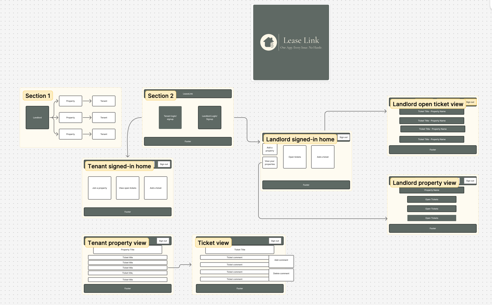
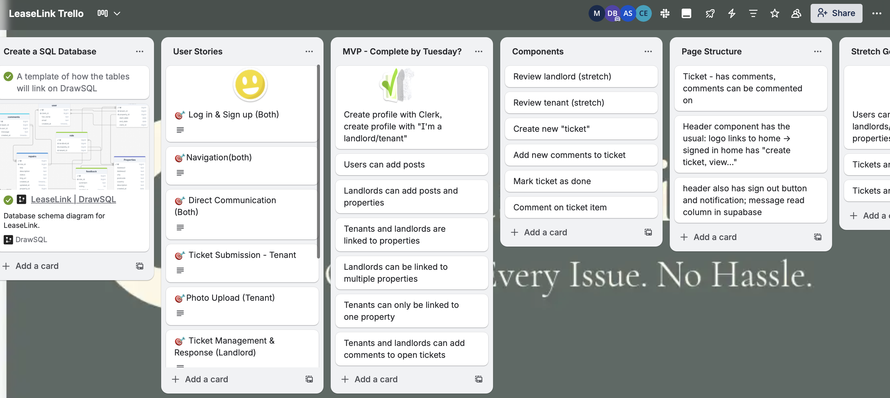
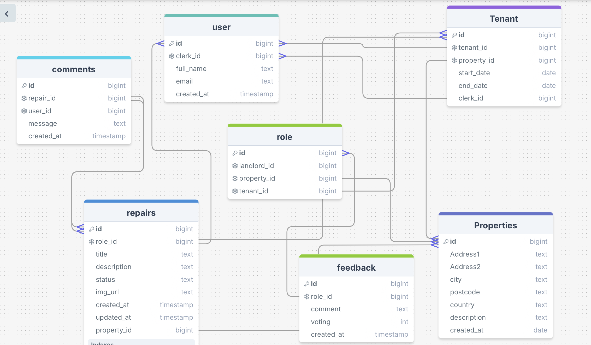
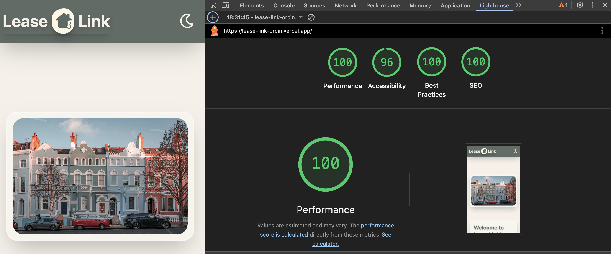

# 🏠 LeaseLink

- 🌐 Vercel link: https://lease-link-orcin.vercel.app/
- 📄 Repo link: https://github.com/daannncb/lease_link

---

## 👬👫 Collaborators: 

- Mah Para Naqvi 🌟

- Callum Everitt 🌟

- Aren Singh 🌟

- Daniel Brownsey 🌟

---

## 📝 Project Description:

This project is about a platform where landlord and tenants communicate efficiently about property repairs and feedback for credibility.

#### Problem domain:

#### User Stories:

- 🎯 Log-in & Sign-Up (Both) -   As a tenant/landlord, I want to be able to sign up/log in with my email address/social

- 🎯 Navigation (Both) - As a tenant, I want a clear navigation menu that shows all available features, so that I can easily find what I need without getting lost.

- As a landlord, I want a navigation menu organised by my main tasks, so that I can quickly access properties, tickets, and tenant information.

- 🎯 Direct Communication (Both) -   As a tenant or landlord, I want to comment directly on specific tickets, so that all communication about an issue stays organized in one thread rather than scattered across texts, emails, and calls.

- 🎯 Ticket Submission - Tenant - As a tenant, I want to create and submit maintenance tickets with photos and descriptions, so that my landlord can understand the issue clearly without back-and-forth messages.

- 🎯 Photo Upload (Tenant) -  As a tenant, I want to be able to upload an image when submitting a ticket so the Landlord can see the exact problem without the need to visit

- 🎯 Ticket Management & Response (Landlord) - As a landlord, I want to view all open tickets from my tenants in one dashboard and provide estimated resolution timelines, so that I can manage expectations and prioritize repairs efficiently.

- 🎯Property Portfolio Dashboard (Landlord) - As a landlord with multiple properties, I want to view all my units, tickets, and tenant information in one dashboard, so that I can efficiently manage my entire portfolio without switching between properties.

- 🎯 Transparency & Tracking (Tenant) - As a tenant, I want to see the current status and timeline for my maintenance requests, so that I know when to expect resolution and don't feel ignored or forgotten.

- 🎯 Responsiveness (both) - As a user of the app, I want to be able to navigate effortlessly and the app to automatically adjust to my screen-size

---

## 🚀 Overview

This project is a full-stack web application built with Next.js (React framework), using JavaScript, Clerk for authentication, and a variety of other modern web technologies. The application is styled using Tailwind CSS.

---

## 🎯 Technical Requirements

- The application must include multiple pages and dynamic routes.

- Use Express.js to set up the server and define API endpoints for a React application, or use Next.js for server-side rendering and database integration.

- Set up a database connection using Supabase with the PG library.

- Implement database operations to save and fetch dynamically generated content (e.g., items, posts, comments, scores) associated with users.

- Demonstrate understanding of database design, including schema planning, and relationships. Provide evidence of database interaction in the form of a seed.js file or a screenshot of your database schema.

- Design a user-friendly, mobile-responsive interface.

- Implement user authentication and authorization for managing access (e.g., admin areas, user-specific content).

---

## 🛠️ Requirements

### 🎯 MVP

 - **Tenant:**
- ✅ 🎯 Sign-up / Login (Clerk)

- ✅ 🎯 Submit repair request with  image

- ✅ 🎯 View repair 

- **Landlord:**

- ✅ 🎯 Sign-up / Login (Clerk)

- ✅ 🎯 View all tenant repairs 

- ✅ 🎯

### 🏹 Stretch Goal

- ✅ 🏹 Tenant submit repair Landlord receive email notifications on new repairs in his email

- ✅ 🏹 Light/Dark Mode theme and keeping it consistent

- ✅ 🏹 Upload Repair Image

- ✅ 🏹 Tenant Feedback with ⭐️

---

## 🛠️🗂️ Intial Planning

#### 🧠 Brainstorming ✅

- Define core features: profiles, listings, repair tracking, reviews, messaging.

#### Step 1: Draw Wireframe

Tools Figma ✅, Trello ✅

#### Step 2: Set up database tables using schema

- Tools: drawsql ✅

- Tools: SQL editor on Supabase. Purpose: to create our tables and seed dummy data.

#### Step 3: Set up Project & GitHub ✅

- Npx create-next-app@latest
- Project-name
- Typescript : No
- ESlint
- Tailwind CSS: YES
- src/directory: YES
- APP Router: YES
- Turbopack: YES
- Import Alias: No
- Remember: Don’t do git init in here
- Cd project name
- npm i
- npm pg
- npm i @clerk/nextjs
- New Repository (no readme)
- Copy paste git remote add origin…..
- Git add .
- Git commit -m “chore: add project template”
- Git push
- Git push -u origin main
- Set up Git collaborators and ruleset for branching
- >>Github- setting- send request for collaboration
- >>github- setting - Ruleset - new branch ruleset - name ruleset - target branch - default - in Branch Rules: ✅ restrict deletion ✅ require a pull request before merging ✅ block force pushes - save changes
- Git checkout -b folderName (after writing the codes,➡️ git add .➡️ git commit -m “”,➡️ git push, ➡️ git push ➡️- git push --set-upstream origin docs )
- Git checkout main
- Merge, review
- Git pull
- Again Git checkout -b folderName …..
- Review, merge
- Code .

#### Step 4: Setup Environment Variables

- .env (.gitignore)

#### Step 5: Deployment

- Deploy on Vercel — set env variables on Vercel dashboard

#### Step 6: Plan Folder Structure ✅

- **📂src**
- 1: 📂 App

- 📂 property 📂 [propertyId] - page.js 📂 repairs -page.js 📂[repairId] -page.js
- 📂 Landlord 📂[landlordId] - page.js
- 📂 Tenants 📂[tenantId] - page.js
- 📂 comments - 📂 [commentId] - page.js 📂delete - page.js
- 📂login 📂 [[…login]]  - page.js
- 📂logout 📂 [[…logout]]  - page.js
- 📂api - 📂uploads
- Errors.js
- notFound.js
- Loading.js

- **📂 Components**

- Header.jsx —- navigation links (import links from next/links)
- Footer.jsx
- CommentList.jsx
- DeleteButton.jsx
- Form.jsx
- PropertyCard.jsx
- RepairLog.jsx
- ReviewList.jsx

- **3: 📂 lib** - queries.sql

- **4: 📂 utils**

- *dbConnection.js set up our database pool using the pg package (install it, please)

**5: 📂 Middleware** - middleware.js

**6: 📂 Images**

#### Step 7: Setup Backend

- Clerk Auth
- Storage bucket
- Supabase

#### Step 8: Build Components

- Header & Footer — site navigation and footer
- CommentList — fetch and show comments for communication
- Form — form for name + comment text input or whatever we decide
- Implement delete button on comments
- MassageList - between tenants and landlord
- PropertyCard - display property images, address, repair status

#### Step 9: Fetch

- Fetch all the data
- Delete comments by comment id
- Confirm deletion before removing

#### Step 10: Styling

- Use Tailwind, google fonts
- Simple cards, forms, buttons, spacing

#### Step 11: Testing

- Test adding comments on individual property
- Test deleting comment
- Confirm navigation works smoothly
- Test Reviews

---

#### Step 12: Reflection ✅

#### Step 13: Lighthouse

#### Step 14: Presentation

- MORE FOLDERS AND FILES
  We can add more files

---

## 🔐 Install and Set Up Clerk Authentication ✅

- Install Clerk
- npm install @clerk/nextjs
- Connect Clerk to App
- Go to Clerk Dashboard → Application → API Keys
- Create .env file and add:NEXT_PUBLIC_CLERK_PUBLISHABLE_KEY=...
- CLERK_SECRET_KEY=...
- Set Up Clerk Middleware ✅
- Create middleware.ts in /src
- Setup public vs protected routes ✅

#### Set Up ClerkProvider ✅

- In root layout.js, 
- wrap app: `<ClerkProvider>` `<html lang="en">` `<body className={font}>` `<Header />` `{children}` `</body></html>` `</ClerkProvider>`

#### Set Up Custom Sign-in / Sign-up Routes

- Create: /app/sign-in/[[...sign-in]]/page.js /app/sign-up/[[...sign-up]]/page.js
- Use: import { SignIn, SignUp } from "@clerk/nextjs";
- Redirect to Custom Routes In .env add:
- NEXT_PUBLIC_CLERK_SIGN_IN_URL=/sign-in NEXT_PUBLIC_CLERK_SIGN_UP_URL=/sign-up 
- NEXT_PUBLIC_CLERK_SIGN_IN_FORCE_REDIRECT_URL=/ 
- NEXT_PUBLIC_CLERK_SIGN_UP_FORCE_REDIRECT_URL=/ Add Clerk UI Components
- Customise as needed
- Test with demo users (email/phone) Access User ID Use:
- import { auth } from "@clerk/nextjs"; const { userId } = auth(); I can store userId to build relationships in my DB

---

## 📨 Sending Email Notifications with Nodemailer

- **Step 1:** Install nodemailer - npm install nodemailer

- **Step 2:** Configure Gmail

- A lot of small companies use gmail for business purposes. 
- Gmail has strict security, so you cannot use your regular password directly.
- Enable 2-Step Verification for your Gmail account.
- Generate an App Password:
- Go to Google App Passwords
- Select “App name (for example LeaseLink”) as the app and click Generate.
- Copy the 16-character app password.

- **Step 3:** Add password in .env

- Add gmail 16 digit password and email address in .env

- GMAIL_USER=your_email
- GMAIL_APP_PASSWORD=16_digit_password

- **Step 4:** Server action 

---

## 🌙⭐️ React Icons

- To install react icon : npm install react-icons —save

- import { icon } from 'react-icons/name';

---

## 🧪 Challenges

- Next.js version 16 was released on the same day we initiated the project, so we had to read the next js official documentation. There were naming conventions, such as "middleware" changed to "Proxy".

- Role Management: Assigning tenants and landlords to properties while keeping roles consistent in the database was tricky.

- Database Relationships: Linking users, roles, properties, repairs, and feedback required careful planning to avoid errors and inconsistencies.

- Email Notifications: Setting up Nodemailer and Gmail authentication involved debugging and security considerations.

- Supabase Image Uploads- uploading images to supabase bucket and linking with datasbe was tricky and time consuming

- Dynamic Pages & Data Fetching: Implementing dynamic property pages and fetching the correct landlord/tenant data without exposing sensitive information was tricky.

- Server Actions & Client/Server Component Separation
---

## 🌟 Lessons Learned

- Plan Database Relationships Before Coding: Mapping tables prevents data inconsistencies later.

- Planning is the most important thing, starting from functionailty and making notes is very important

- Working on the functionality at early stages and planning stages is important

- Always Check for Nulls and Defaults

- Auth and Current User Logic is Crucial

- Collaboration Matters

- Detailed Logging Helps Debug

---

## 🙏 Credits

- Manny Gonzalez (Instructor)

- Joe Venton

- Tim Smith

- Bertie Raffle

---

## 🙌 Final Thoughts

LeaseLink demonstrates how modern web technologies can be combined to solve real-world problems in property management. This project reinforced the importance of planning your data flow and component hierarchy before coding. Planning stage is very important and starting from the basic structure with functionality in mind should be the first priority. 

#### Future improvements could include:

- Enhanced notifications for repair requests.

- Advanced analytics for landlords.

- WhatsApp and phone notification.

- Tenant-landlord chat system for better communication.

- This project is a strong foundation for a full-featured property management platform.

- Uploading repair images effectively

---

## 📘 Resources

- [PostgreSQL](https://neon.com/postgresql/postgresql-tutorial/postgresql-boolean)
- [PostgreSQL](https://leapcell.medium.com/14-rules-for-designing-mysql-tables-de03565305a2)
- [PostgreSQL Update](https://neon.com/postgresql/postgresql-tutorial/postgresql-update)
- [Supabase Image](https://supabase.com/docs/guides/storage/serving/image-transformations)
- [Supabase Docs](https://supabase.com/docs/reference/javascript/storage-from-getpublicurl)
- [Fetching Image from Supabase](https://stackoverflow.com/questions/74762044/fetching-image-from-supabase-storage-through-database-table-returns-undefined-ur)
- [Images from Supabase](https://community.weweb.io/t/displaying-an-image-from-supabase/5630/8)
- [Light and Dark Mode](https://www.youtube.com/watch?v=N17qMDl4PyM)
- [Send email with Next Resend](https://resend.com/docs/send-with-nextjs)
- [Supabase Edge Function](https://trigger.dev/docs/guides/frameworks/supabase-edge-functions-basic)
- [Supabase Edge Function](https://www.youtube.com/watch?v=DmErV2mvvH0)
- [Send emails with edge function](https://www.youtube.com/watch?v=Qf7XvL1fjvo)
- [SQL Triggers](https://www.datacamp.com/tutorial/sql-triggers)
- [Image Upload](https://uploadcare.com/blog/javascript-upload-image-tutorial/)
- [useTheme Hook](https://reactnavigation.org/docs/use-theme/)
- [Sending Emails with Nodemailer](https://resend.com/docs/send-with-nodemailer-smtp)
- [Sending Email Notification using Nodemailer and Gmail](https://www.youtube.com/watch?v=I3W1JfzOzks)
- 
